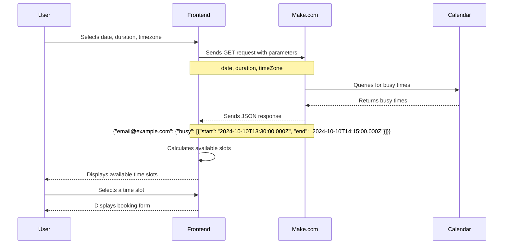

# Browser to Backend Example: Make.com Webhook Integration Demo Appointment Booking System

## Overview
This project demonstrates how to integrate a web frontend with Make.com (formerly Integromat) using webhooks and JSON. It showcases a simple appointment booking system that interacts with Make.com scenarios to check calendar availability and potentially book appointments.


## Purpose
The primary goal of this demo is to illustrate:
1. How to send data from a web frontend to a Make.com webhook
2. How to process and return JSON data from Make.com to a web application
3. Real-world application of Make.com in a booking system scenario

## Flow Diagram



## Features
- Date, duration, and timezone selection for appointments
- Integration with Make.com webhook for availability checking
- Display of available time slots based on busy times returned by Make.com
- Demonstration of JSON parsing and timezone handling

## Technical Stack
- Frontend: HTML, CSS, JavaScript
- Backend: Make.com webhook and scenario

## Setup and Usage
1. Clone the repository
2. Open `index.html` in a web browser
3. Set up a Make.com scenario with an HTTP webhook trigger
4. Update the webhook URL in `app.js` to point to your Make.com scenario
5. Configure your Make.com scenario to return busy times in the format shown below

## Make.com Integration
This demo expects the Make.com webhook to return busy times in the following JSON format:

```json
{
  "email@example.com": {
    "busy": [
      {
        "start": "2024-10-10T13:30:00.000Z",
        "end": "2024-10-10T14:15:00.000Z"
      },
      {
        "start": "2024-10-10T15:15:00.000Z",
        "end": "2024-10-10T17:00:00.000Z"
      }
    ]
  }
}
```

The frontend sends a GET request to the Make.com webhook with the following parameters:
- `date`: Selected date (YYYY-MM-DD)
- `duration`: Appointment duration in minutes
- `timeZone`: Selected timezone

## Key Learning Points
- Sending and receiving data between a web frontend and Make.com
- Handling JSON responses in JavaScript
- Working with timezones and date/time calculations
- Demonstrating practical use of Make.com in a web application context

## Customization
You can extend this demo by:
- Adding appointment booking functionality
- Integrating with actual calendar systems through Make.com
- Implementing user authentication
- Adding email notifications for bookings

## Contributing
This project is meant as a learning tool and demo. Feel free to fork and expand upon it for your own use cases or to suggest improvements.

## License
[Specify your license here]